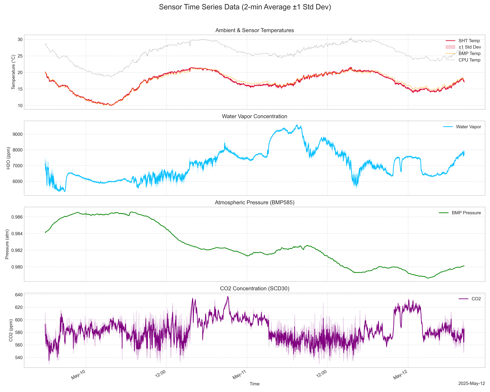

# weather_station

A little weather station I built to go with my spectrometers.

*(The finished weather station setup)*

This is a project for a small, reasonably cheap weather station. The main idea was to have something to measure atmospheric conditions (especially pressure and temperature) when running laser spectrometers. Those readings are complimentary to the measurements of greenhouse gases. But I thought it would be also nice to track humidity and CO2 levels.

I sometimes do the measurements in different places, so I included a GPS receiver. This gives me location, altitude, and time, which I can then use to blend my data with weather models like ERA5.

There are probably off-the-shelf weather stations, but I wanted a specific set of sensors, aiming for good precision for each measurement.
UPD: This is a standard P/T/H station for EU measurements with COCCON: PCE-THB 40 for 300 eur
https://www.pce-instruments.com/deutsch/messtechnik/messgeraete-fuer-alle-parameter/temperatur-datenlogger-temperaturlogger-pce-instruments-temperatur-datenlogger-pce-thb-40-det_3711876.htm

## What's Inside & Cost

Here's the parts list. Total comes out to around $153 USD:

1.  **GPS:** Adafruit ULTIMATE GPS PA1616S - $30
2.  **Pressure:** MIKROE-5921 BMP585 board - $23 (This sensor is new and most precise +-6Pa relative and +-50 Pa absolute accuracy)
3.  **CO2:** Sensirion SCD30 - $33 (Stable NDIR CO2 sensor +-30.0 ppm)
4.  **Temp/Humidity:** Sensirion SHT85 - $28 (Sensirion is known for good accuracy 1.5	%RH accruacy and 0.1 degC for temperature)
5.  **MCU:** Teensy 4.1 - $39 (Versatile and fast up to 600mhz)

An SD card isn't strictly necessary, but if you want to log data, a 16GB one formatted to FAT32 works fine.

## Putting it Together

*(How things are wired up)*

I just soldered everything onto a perfboard. No PCB design for this one, as I didn't have the time, and perfboarding it took about a day of wiring and soldering.

*(The soldered parts)*

Try to put SHT85 sensor away from the heat sources - as this is your precise measurement of air temperature.

The 3D printed enclosure files are great, but you have to stop mid print to insert m3 nuts for the top part. The sensors and Teensy fit nicely. You'll likely need to print 9 of the "middle sections" to get enough height to cover the board properly. You also need m3 rods to connect the parts.

## The Code

 Most of the code was written by Gemini 2.5 Pro Preview (Google). It works... But I am in the middle of my PhD so there is no time for a more readable version.

### Libraries You'll Need:

They are included in the repo, but most of them could be installed via Arudino interface in IDE. Also there was no library for Bosch sensor, so I took parts of the code from this website https://www.electroniclinic.com/bosch-bmp585-barometric-pressure-sensor-with-arduino/

### Getting it Running:
1.  Make sure you have the Arduino IDE and Teens set up.
2.  Install the libraries listed above.
3.  Grab the code from this repository.
4.  Open the main `.ino` file, select Teensy 4.1 as your board, and upload. I also recommend setting teensy CPU speed to 24Mhz in "tools" menu but this is already done.

## How it Works (Briefly)

It checks for SD card, communicates to the sensors and then starts logging data and sending it to the UART. Logging interval is 1 second. After 12hours of logging it will make a new CSV on SD card. If something goes wrong the main LED will turn on. You can also monitor the status via serial interface in arduino. 

This is the CSV header:
"Log_Index,CPU_TempC,BMP_TempC,BMP_PressPa,CO2_ppm,SCD30_TempC,SCD30_Hum_%,SHT_TempC,SHT_Hum_%,GPS_Lat,GPS_Lon,GPS_Alt_m,GPS_Year,GPS_Month,GPS_Day,GPS_Hour,GPS_Min,GPS_Sec,GPS_MilliSec,GPS_Fix,BMP_Health,SCD30_Health,SHT_Health"

Field Descriptions:

- **Log_Index**: For-loop cycle count.
- **CPU_TempC**: Temperature of the Teensy core in °C.
- **BMP_TempC**: Temperature from the BMP585 sensor in °C.
- **BMP_PressPa**: Pressure from the BMP585 sensor in Pascals (Pa).
- **CO2_ppm**: CO2 concentration in ppm from the SCD30 sensor.
- **SCD30_TempC**: Temperature from the SCD30 sensor in °C.
- **SCD30_Hum_%**: Humidity from the SCD30 sensor in %.
- **SHT_TempC**: Temperature from the SHT85 sensor in °C (most precise air temperature).
- **SHT_Hum_%**: Humidity from the SHT85 sensor in % (most precise air humidity).
- **GPS_Lat**, **GPS_Lon**: Coordinates in decimal degrees.
- **GPS_Alt_m**: Altitude above sea level in meters.
- **GPS_Year**, **GPS_Month**, **GPS_Day**, **GPS_Hour**, **GPS_Min**, **GPS_Sec**: Time from GPS.
- **GPS_MilliSec**: Milliseconds from GPS (currently always 0).
- **GPS_Fix**: 1 if GPS has a fix, 0 otherwise.
- **BMP_Health**: 1 if BMP585 is healthy, 0 otherwise.
- **SCD30_Health**: 1 if SCD30 is healthy, 0 otherwise.
- **SHT_Health**: 1 if SHT85 is healthy, 0 otherwise.

## Some results

Here are measurements for the weekend

*(Measurements during 2 days in the shade in the city)*

And here is a comparison between different sensors

*(cross-comparison between sensors on the weather station)*

## Future tasks

1. Write visualisation from csv in Python
2. Write visualisation in real time in LabView
3. Write SD reading directly from Arduino
4. Fix GPS_MilliSec always = 0
5. Add MTP support to copy files from SD card directly

## Licensing

The code in this project is licensed under the MIT License - see the `LICENSE` file for details.

1.  **3D models:**
    *   The 3D models included in the `/3d_models` directory are licensed under the (CC BY 4.0).
    *   Source: https://www.printables.com/model/73421-radiation-shields-for-diy-weather-station
2.  **Adafruit GPS Library:**
    *   Licensed under the [BSD 3-Clause License]. The full license text is included with the library files.
    *   Source: https://github.com/adafruit/Adafruit_GPS?tab=License-1-ov-file#readme
3.  **Arduino-sht Library:**
    *   Licensed under the [BSD 3-Clause License]. The full license text is included with the library files.
    *   Source: https://github.com/Sensirion/arduino-sht?tab=BSD-3-Clause-1-ov-file#readme
4.  **InternalTemperature Library:**
    *   No license was provided in the repository at the time of creation of this document
    *   Source: https://github.com/LAtimes2/InternalTemperature
5.  **SD Library:**
    *   Licensed under the [GNU GENERAL PUBLIC LICENSE]. The full license text is included with the library files.
    *   Source: https://github.com/arduino-libraries/SD?tab=GPL-3.0-1-ov-file#readme
6.  **SparkFun_BMP581_Arduino_Library Library:**
    *   Licensed under the [MIT License]. The full license text is included with the library files.
    *   Source: https://github.com/sparkfun/SparkFun_BMP581_Arduino_Library?tab=License-1-ov-file#readme
7.  **SparkFun_SCD30_Arduino_Library Library:**
    *   Licensed under the [MIT License]. The full license text is included with the library files.
    *   Source: https://github.com/sparkfun/SparkFun_SCD30_Arduino_Library?tab=License-1-ov-file#readme
8.  **WDT_T4 Library:**
    *   Licensed under the [MIT License]. The full license text is included with the library files.
    *   Source: https://github.com/tonton81/WDT_T4?tab=MIT-1-ov-file#readme
9.  **BMP585 code:**
    *   No License was visible on that page at the time of writing this document
    *   Source: https://www.electroniclinic.com/bosch-bmp585-barometric-pressure-sensor-with-arduino/

